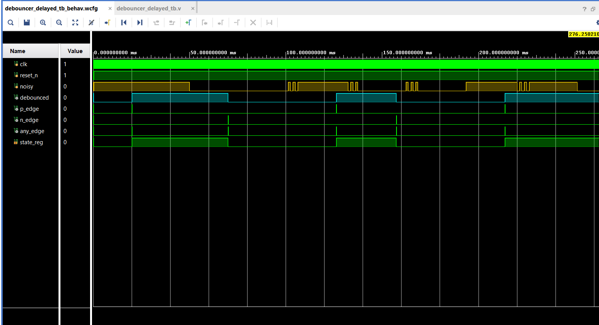

# Buttons-Debouncing-Edge-Detection
# System Clock up to 200 MHz (Depended on LUTs technology of Arty z7)
* Dealing with Buttons in Verilog Debouncing &amp; Edge Detection

> 

* Debouncer_FSM (MORE FSM)

> 

* Edge_Detection_FSM (MEALY FSM)

> 

# Implementation

* Hierarchy module:
    * debouncer_delayed
        * debouncer_delayed_fsm FSM0
        * edge_detector EDGE_DE
        * timer_parameter #(.COUNTER_VALUE(999_999)) T0 // COUNTER_VALUE = 999_999(De10 nano 50MHz) or 1_999_999(Arty z7 100MHz)

        > 

* Performance (implementation on Arty z7)
> 
> 
> 
> 

* Simulation
    * Behavioral Simulation
    > 
    > 

    * Post-Synthesis Timing Simulation
    > 

* Demo on the De10 Nano board
    * Pin Planner
    > 

    * Test
    > 
